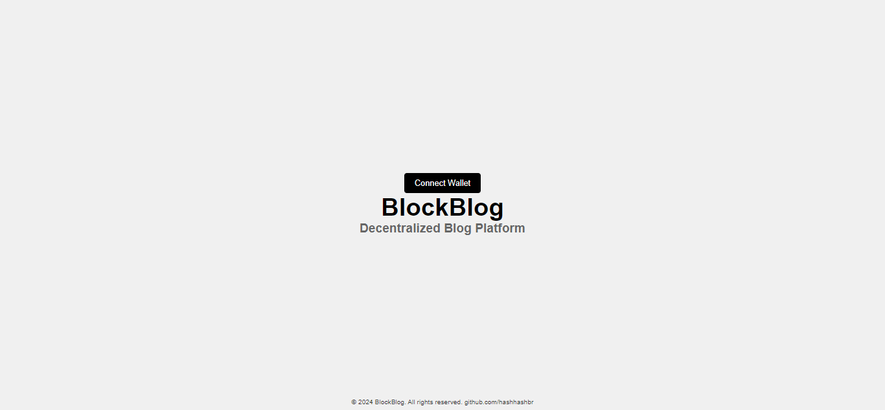

# BlockBlog - Decentralized Blog Platform

## Overview

**BlockBlog** is a decentralized blogging platform built on the Ethereum blockchain. It allows users to create, edit, and delete blog posts securely and transparently, leveraging blockchain technology for content management. The platform integrates with MetaMask for authentication and uses smart contracts written in Solidity to manage posts on the Ethereum Sepolia test network.

## Features

- **Decentralized Content Management**: Posts are stored and managed on the Ethereum blockchain.
- **User Authentication**: Users authenticate via MetaMask.
- **Post Creation and Management**: Users can create, edit, delete, and view their posts.
- **Profile Management**: Users can create and manage their profiles.
- **Responsive Design**: The frontend is fully responsive, offering a seamless experience across devices.
- **IPFS Integration**: Users can upload images via IPFS, and previews are generated automatically.

## Technologies Used

- **Blockchain**: Ethereum Sepolia Testnet
- **Smart Contracts**: Solidity
- **Frontend**: React.js with Material-UI
- **Backend**: Node.js
- **Database**: (To be decided)
- **Wallet Integration**: MetaMask
- **Hosting**: IPFS (InterPlanetary File System)
- **API Integration**: Infura

## Setup and Installation

### Prerequisites

- Node.js and npm installed
- MetaMask extension installed
- Access to Ethereum Sepolia test network

### Demo Video

[BlockBlog](./assets/blockblog.mp4)
